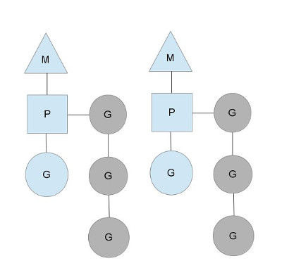

## 探究go语言的并发和并行原理。
> 原文地址: https://github.com/googege/blog/tree/master/go/go/concurrency/README.md

### goroutine基于线程池的P:M:G协程模型
首先说明一下go可以有两种并发方式
- csp

    也就是最常使用的go并发模式，这中模式无法进行信息的直接交换，所以go中运用了chanel来交换数据
- 共享内存

    通常意义上可以理解为通过共享了内存进而来通信的并发方式，例如加lock
    这种模式可以直接交换数据，但是为了并发安全需要加锁。

首先我们谈谈关于cpu和操作系统线程，进程的那些事：
我们通常都听过这个一个词，cpu 4核8线程，这里的意思就是cpu实际内核是4核，但是在操作系统看来是8核
cpu，这里的8线程就是指的是8个虚拟内核。
然后再操作系统层面，划分为进程和线程，这里的进程是cpu资源分配（io储存等）的基本单位，在线程出现之前
它也是cpu进行调度分配的基本单位，注意这里的线程是操作系统的概念，跟4核8线程里的概念不是一回事，而协程
也就是coroutine是编程语言层面上的最近才有的一个东西，go里面的goroutine也可以看做是能实现并发的协程

我们知道，在操作系统的层面上而言，实现并发就是多个线程在一个cpu核心里接替执行，如果是并行呢，就是多个线程
在多个cpu内核里同时执行，这里的同时才是真同时，而并发是"肉眼可见的同时但 是光速里的交替执行"如果是高cpu密集计算
形式的任务其实不需要那么多个线程，只需要几个线程然后将他们分配到多个核心进行计算，这样上下文调度的时间就少了
非常多了，多io形式的不需要多核，单核多线程就足够了。

go实现并发的模式是PMG

如图：

p就是上下文context m就是machine也就是对应着操作系统线程 g就是goroutine 我们来看看对应的关系

首先m对应了一个kse也就是操作系统中的一个线程，然后这个m下面有一个p就是上下文调度，然后这个p上面有一个初始
的g goroutine和一个队列，这个队列里是一批的goroutine，这个就是PMG模型。这里有无数个想这样的单位，如果谁
的活干完了那么它就会去抢夺别的队列的东西，并且分走一半的任务。

其实 goroutine 用到的就是线程池的技术，当 goroutine 需要执行时，会从 thread pool 中选出一个可用的 M 或者新建一个 M。
而 thread pool 中如何选取线程，扩建线程，回收线程，Go 调度器 进行了封装，对程序透明，只管调用就行，从而简化了
thread pool 的使用，它是定义在proc.c中，它维护有存储M和G的队列以及调度器的一些状态信息

- 问 什么时候会创建另一个kse呢？（操作系统的线程）

我们可以这么看这个模型，一个地鼠推着一个车子，车子上是砖头，地鼠就是m车子就是p砖头就是g而m对应了一个kse，那么
什么时候会创建另一个m呢？runtime什么时候创建线程？砖(G)太多了，地鼠(M)又太少了，实在忙不过来，刚好还有空闲的小车(P)没有使用 当这个地鼠发现自己的活太多的时候，调度器就会再启动一个m也就是线程池的概念，在操作系统层面
从这个池中重新分配一个kse让他继续干活。如果一个m发现自己没活了，那么它会主动去揽活儿，如果发现没活了那么它就会去偷取同伴m的g
直接拿走一半，如果同伴也没了，那么它就去睡觉了，也就是sleep了，

- go的GOMAXPROCS 是干嘛的？

在go语言启动的时候会首先查看gomaxprocs，它会根据设置的数量来创建一批p，然后将他们储存在调度器里，以链表的方式储存。它就是小推车呀

- 解析goroutine协程和kse的关系

上面说了轻量级kse（操作系统线程）才是cpu调度的基本单位，你goroutine算什么？，然后刚说了mpg，m就是这个kse p就是上下文，g就是goruntine，当然除此之外，go还有一个调度器
然后go在这个kse中模拟了线程执行的过程，让p负责管理，这个时候p没办法主动去取消g，只能g执行完了主动告诉p说我执行完了
然后p把状态保存到栈上，然后执行另一个g，等到所有的g都执行完都返回了，就跟刚才说的一样这个m开始去取新的任务了，或者就是将p
还给调度器然后自己休息了。

- cpu执行的时候能同时执行多个进程吗？

答案是不行，cpu去执行进程的时候只能去操作这个进程中的多个线程，然后将这些个线程分配到不同的cpu内核中。它是无法去执行多个进程的
因为cpu同时只能执行一个进程。
- cpu同时只能执行一个进程，那么我的计算机里为什么可以同时运行多个程序呢？

操作系统调度器（区分于go中的调度器哦） 拆分CPU为一段段时间的运行片，轮流分配给不同的程序。这样的话就仿佛可以同时执行不同的程序进程了，还记得
你使用`kill`命令的时候吗？杀的就是进程，这些进程不能同时运行，他们被分配到不同的cpu片段里。

- 为什么除了操作系统调度器go还有一个自己的调度器

单独的开发一个GO得调度器，可以是其知道在什么时候内存状态是一致的，也就是说，当开始垃圾回收时，运行时只需要为当时
正在CPU核上运行的那个线程等待即可，而不是等待所有的线程。不然如果只有os的调度器，那gc的时候就要全部停下了。

综上所述：

- cpu同时只能执行一个程序（操作系统kse进程）（例如同时执行一个go程序然后接下来再单独执行一个qq）但是操作系统将cpu分为了多时间片段，并且速度够快，所以你看起来就是同时执行喽

- cpu可以将这个进程中的很多线程分配到不同的cpu核心里。这样就实现了并行，因为它只能识别一个进程，但是进程中有很多线程。

- 线程池的概念在go中主要是用于分配那个m

- GOMAXPROCS的功能是为了分配p也就是车子，分配好了车子就储存在调度器中，m可多可少，但是车是一定的。

- 在这个车子中g的数量可多可少，可以非常多，那么m也就是这个kse是根据GOMAXPROCS来定的，他的数量<= GOMAXPROCS指定的数量，但是最多不能超过256（不论你的gomaxpocs设置的是多少）

- cpu将这个m也就是操作系统线程分配到多个cpu内核中

- 如果GOMAXPROCS设置是1 那么只能讲这个线程分配到一个cpu内核中了，所以就是并发不能并行了

- 上下文context 也就是p 管理着这里面一个队列的的很多个的goroutine

- go单独于os的调度器也就是区别于os的调度器 它是管理这个线程池的  --- 管理如何分配m

### channel 基于生产者消费者模型的无锁队列

首先解释一下什么是生产者消费者模式：
有三个东西，生产数据的一个任务（可以是线程，进程函数等）一个缓存区域，一个使用数据的任务
这个模式基本上可以类比：厨师做饭+把饭放到前台+你去端饭。

还记得上文谈的csp模型吗？这里的channel就是csp中通信的部分，上文的goroutine是并发实体

channel的创建是使用的make，那么这说明了什么？说明了channel的初始值肯定是nil，channel变量是一个引用变量（具体是一个struct的指针）

channel分为两种：无缓存的channel和有缓存的channel什么区别呢？无缓存的就是有东西就需要读，不读就没法再往里面加东西
有缓存的就是不读也能继续加东西。就这么个区别。Channel是Go中的一个核心类型，你可以把它看成一个管道，通过它并发核心单元
就可以发送或者接收数据进行通讯。

### net.conn 基于epoll的异步io同步阻塞模型

epoll是Linux为了替代poll模型而打造的支持高并发的模型，net.conn基于这个模型进行打造。其实就是go调用了Linux的epoll模型来打造的net.conn
同步阻塞 其实就是调用多goroutine+非缓存的channel来实现。

### syscall 基于操作系统的原生syscall能力
go语言里的读取都可以使用操作系统提供的syscall功能，几乎所有 Linux 文件相关系统调用，Go 都有封装
### gosched 基于阻塞的协程调度

### go gc基于三色标记法的并发gc模型

### net/http基于goroutine的http服务器

### 并发安全的hash map slice

### 可选性能优化手段unsafe非并发安全的指针调用

### 可实现cas context基于channel的goroutine流程控制能力

### 非并发安全的指针

### 以实现有限的动态性atomic基于cpu原子操作的包装，