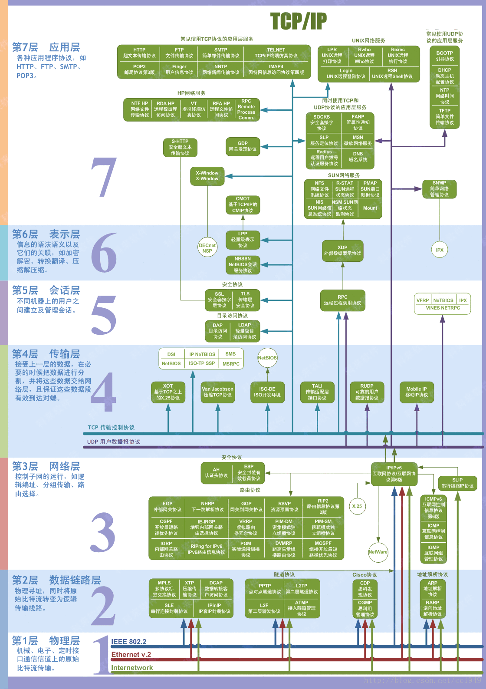
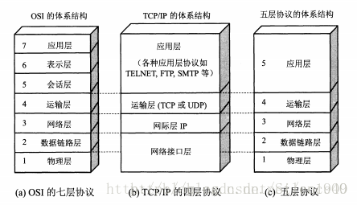
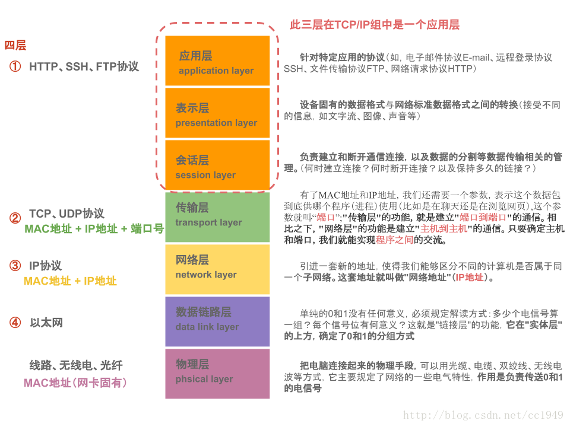
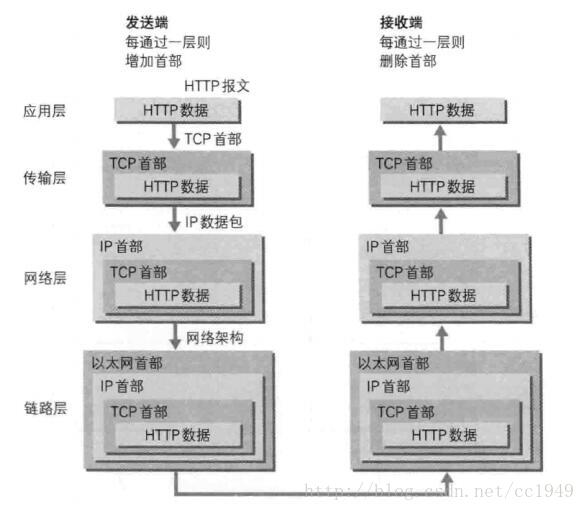

## 网络协议知多少

总体来说可以分为这么几层

业界有三种划分方法，分别为7层，5层和四层
我们来看几个图

### 7层：
7层是指OSI七层协议模型，主要是：应用层（Application）、表示层（Presentation）、会话层（Session）、传输层（Transport）、网络层（Network）、数据链路层（Data Link）、物理层（Physical）

### 5层
5层只是OSI和TCP/IP的综合，是业界产生出来的非官方协议模型，但是很多具体的应用。实际应用还是TCP/IP的四层结构。为了方便可以把下两层称为网络接口层。五层体系结构包括：应用层、运输层、网络层、数据链路层和物理层。

### 4层
4层是指TCP/IP四层模型，主要包括：应用层、运输层、网际层和网络接口层。

### 传输过程

### 什么是http协议的三次握手
其实是tcp协议中的三次握手，具体可以看这个图

参考资料（感谢这些作者们）：
https://blog.csdn.net/cc1949/article/details/79063439

